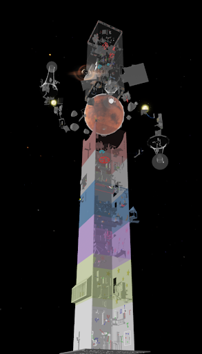
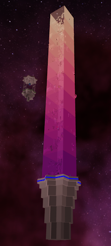
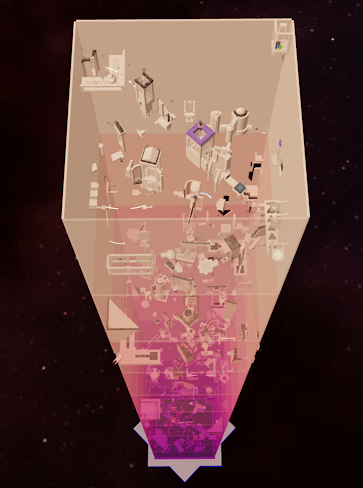
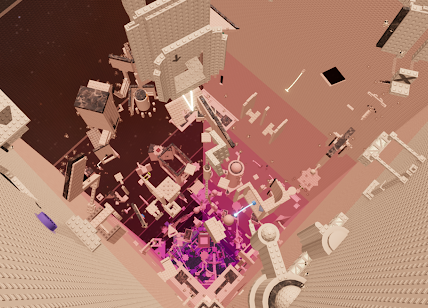
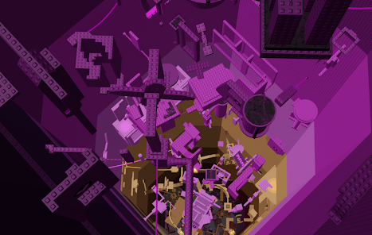
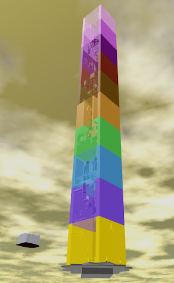
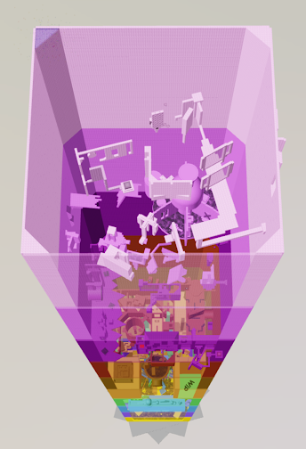
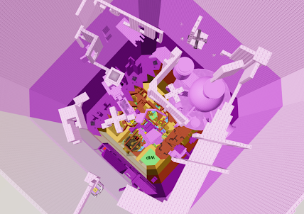

# Tower Projects
Brandon Tan 
bttan@ucsd.edu

This document presents the numerous projects that I have developed for Eternal Towers of Hell from 2020 to 2025. Please note that if you wish to test any of these projects, you must install ROBLOX and be logged into an account. Otherwise, you can still view each project on YouTube with the video links provided.

## Tower of Mechanical Physics (2023-2025)
[Play Project](https://www.roblox.com/games/17004361863/Tower-of-Mechanical-Physics) 

  
  
  

## Tower of Quaint Activations (2021-2022)
[View Wiki](https://jtoh.fandom.com/wiki/Tower_of_Quaint_Activations) 
[Play Project](https://www.roblox.com/games/8020574527/Tower-of-Quaint-Activations) 
[Watch Video](https://www.youtube.com/watch?v=dokHEMYhc_E)

  
  
  

## Tower of Brief Challenges (2021-2021)
[View Wiki](https://jtoh.fandom.com/wiki/Tower_of_Brief_Challenges) 
[Play Project](https://www.roblox.com/games/6347821389/Tower-of-Brief-Challenges) 
[Watch Video](https://www.youtube.com/watch?v=I8l_BfnJ1yQ)

  
  
  

## Tower of Ubiquitous Challenges (2020-2021)
[View Wiki](https://etoh-misc.fandom.com/wiki/Tower_of_Ubiquitous_Challenges) 
[Play Project](https://www.roblox.com/games/6083674493/Tower-of-Ubiquitous-Challenges) 
[Watch Video](https://www.youtube.com/watch?v=uP8LhtZ-X4c)

  
  
  

