

# Tower Projects

**A collection of obby towers built for *Eternal Towers of Hell*, 2020–2025**

**Brandon Tan**

---

## About

This repository showcases the towers I have designed and built for [**Eternal Towers of Hell**](https://jtoh.fandom.com/wiki/Eternal_Towers_of_Hell_(Game)) (ETOH), a large-scale collaborative Roblox obby, spanning projects from 2020 through 2025.

Each entry below includes links to play the tower in-game, view its wiki page, and watch a video playthrough. Playing a project requires a [ROBLOX](https://www.roblox.com/) account and client installed; if you'd rather not install anything, the YouTube links let you watch a full playthrough instead.

> The year range beside each title marks that tower's development period, from initial concept to release ("Ongoing" indicates active development).

## Contents

- [Tower of Mechanical Physics](#tower-of-mechanical-physics-2023--ongoing) *(2023–Ongoing)*
- [Tower of Quaint Activations](#tower-of-quaint-activations-2021--2022) *(2021–2022)*
- [Tower of Brief Challenges](#tower-of-brief-challenges-2021) *(2021)*
- [Tower of Ubiquitous Challenges](#tower-of-ubiquitous-challenges-2020--2021) *(2020–2021)*

---

## Tower of Mechanical Physics (2023 – Ongoing)

🔗 [Play Project](https://www.roblox.com/games/17004361863/Tower-of-Mechanical-Physics)

  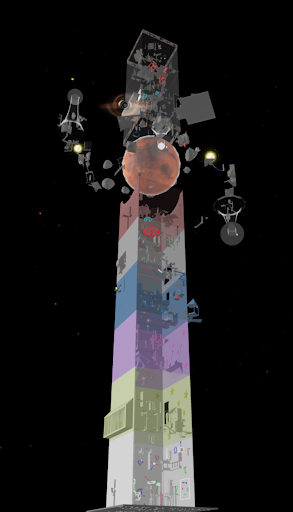
  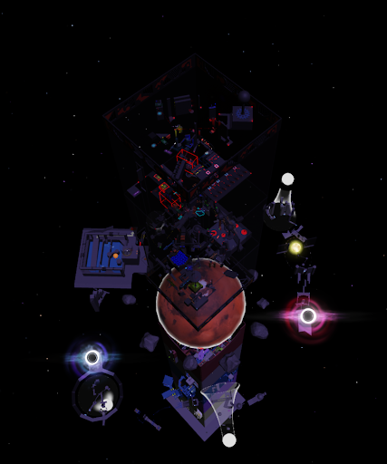
  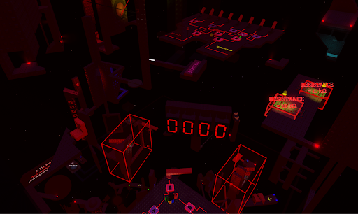

---

## Tower of Quaint Activations (2021 – 2022)

🔗 [Play Project](https://www.roblox.com/games/8020574527/Tower-of-Quaint-Activations) · 📖 [View Wiki](https://jtoh.fandom.com/wiki/Tower_of_Quaint_Activations) · ▶️ [Watch Video](https://www.youtube.com/watch?v=dokHEMYhc_E)

  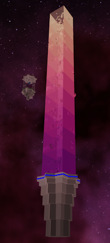
  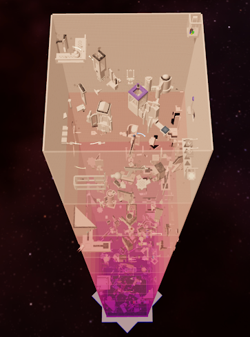
  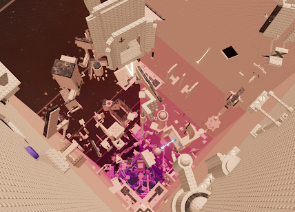

---

## Tower of Brief Challenges (2021)

🔗 [Play Project](https://www.roblox.com/games/6347821389/Tower-of-Brief-Challenges) · 📖 [View Wiki](https://jtoh.fandom.com/wiki/Tower_of_Brief_Challenges) · ▶️ [Watch Video](https://www.youtube.com/watch?v=I8l_BfnJ1yQ)

  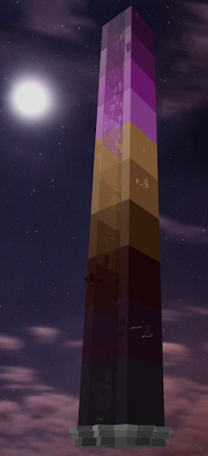
  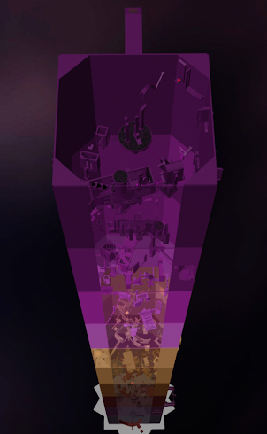
  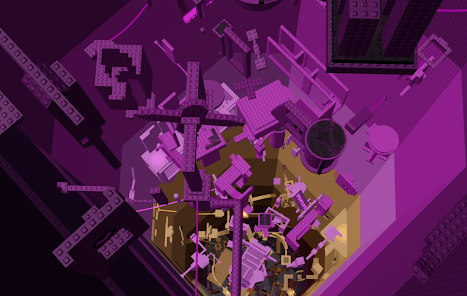

---

## Tower of Ubiquitous Challenges (2020 – 2021)

🔗 [Play Project](https://www.roblox.com/games/6083674493/Tower-of-Ubiquitous-Challenges) · 📖 [View Wiki](https://etoh-misc.fandom.com/wiki/Tower_of_Ubiquitous_Challenges) · ▶️ [Watch Video](https://www.youtube.com/watch?v=uP8LhtZ-X4c)

  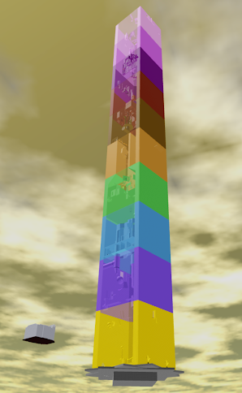
  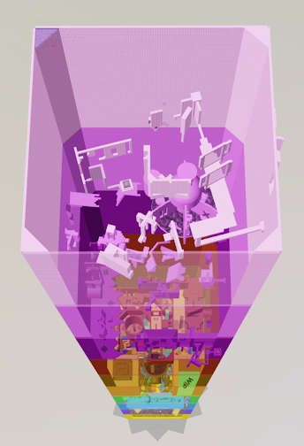
  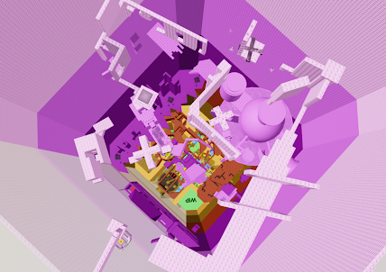

---

**Contact:** [brandon.tj.tan@gmail.com](mailto:brandon.tj.tan@gmail.com)

